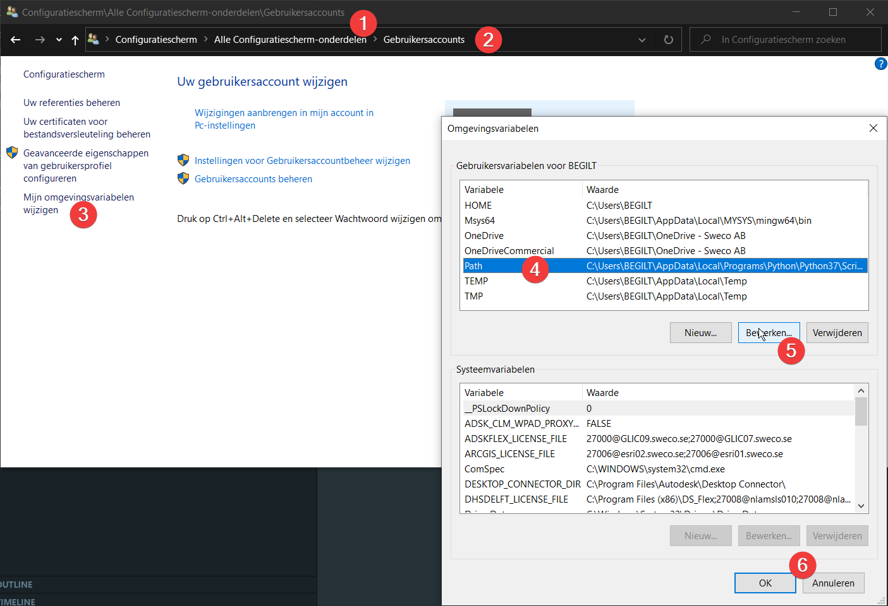

# OCCT Sandbox

Open Cascade Technology (OCCT) Sandbox. Place to play around with the API.

## Configure, Build and Run

To generate a build, I'm relying on a build system, **make**. However, the build system is created by **cmake**, a tool to generate a build system, platform independent. What it does, after some initial configuration, is building a *build* folder containing all necessary files and a preconfigured *Makefile* where all links and libraries locations are added to generate a binary using **make**.

In the main directory, simply run `make` to execute a couple of shell scripts that:
1. run `cmake` and make the *build* directory
2. run `make` inside the *build* directory
3. run the *binary* that has been created

You can have a look inside the *tools* directory what the shell scripts are doing.

As you probably noticed, `make` is used twice in this workflow. By running `make` inside the main directory, the *configure, build and run* procedure is started which consists of the 3 earlier discussed steps. In the second step, `make` is used to start the build in the *build* directory.

## Project structure

While I'm not following the *best practices* at the moment, this might change in the futur. I'll follow [this guideline](https://api.csswg.org/bikeshed/?force=1&url=https://raw.githubusercontent.com/vector-of-bool/pitchfork/develop/data/spec.bs#intro) whenever this project start to become bigger. 

## Installing Open Cascade

One of the dependencies is **Open Cascade** ofcourse. The installation procedure depends on the operating system you're running. Currently, I'm only including the installation process for linux and mac. 

We need to **distinguish OCE and OCCT**, both related to Open Cascade Technology, but the first one is the Community Edition. It includes a couple of patches. However, the ease of installation depends on the operating system. OCE is very easy to install on Ubuntu, while OCCT is the easiest on MacOS.  

### Dependencies

To build the code, you'll need a **compiler** like `gpp`, `make` and `cmake`.

To install `cmake`, please see the [official documentation](https://cmake.org/install/).

### Ubuntu

Normally, `make` should come out of the box (I guess so...). To install `cmake`, you could also use snap (`snap install cmake`) to install the tool on Ubuntu. 

Run the following:
```shell
sudo apt update -qq
sudo apt install -y liboce-*
```

### MacOS

Install XCode (see the Apple [Developer website](https://developer.apple.com/xcode/)) and the command line utilities (`sudo xcode-select --install`). Make sure to have `cmake` installed as well. 

Then, install *Homebrew* (see [official documentation](https://brew.sh/)), and run the following:
```
brew install opencascade
```

### Windows

#### Installation of the **Compiler**   

First, you need to isntall a C++ compiler. Follow the installation guide of [MSYS2](https://www.msys2.org/). 
After the installation, add the directory to your path.

Add the following paths to `%PATH%`

```shell
C:\Users\<user>\AppData\Local\MSYS2\usr\bin\
C:\Users\<user>\AppData\Local\MSYS2\mingw64\bin\
```
In my case, I choose to install MSYS2 inside my user folder.



To test if it's working, check if `make` and `gcc` are available using `where <command>`.

#### Installation of `cmake`

After installing the compiler, we'll install `cmake`. Download the `.zip` from their website and locate the extracted files inside the following path:

```shell
C:\Users\<user>\AppData\Local\CMake\
```
Add the following path to your `%PATH%`, see the method above:

```shell
C:\Users\<user>\AppData\Local\CMake\bin
```
Check if it's working: `where cmake`

#### Installation of **OCCT**

Download the `.tgz` from the [official docs](https://dev.opencascade.org/release) and uncompress the file. 

Move the files to:

```shell
C:\Users\BEGILT\AppData\Local\OCCT
```
Now, we need to compile the source data. However, Open Cascade depends on some other packages. 
You can download a precompiled package from [their website](https://dev.opencascade.org/resources/download/3rd-party-components). **Freetype** is required. Download the `.7z` for **MinGW** and move the files to:

```shell
# Add Freetype
C:\Users\<user>\AppData\Local\Freetype
```
You could also build the files from source, see the [guidelines](https://dev.opencascade.org/doc/overview/html/build_upgrade_building_3rdparty.html) on the website of Open Cascade.

Follow the same procedure for **Tcl**, because it's also required! Store it in the following folder:
```shell
# Add Freetype
C:\Users\<user>\AppData\Local\Tcl
```

The next step is to compile OCCT:

```shell
cmake -G"MSYS Makefiles" -D USE_VTK=OFF -D USE_FREEIMAGE=OFF -D USE_D3D=OFF -D 3RDPARTY_FREETYPE_DIR="C:/Users/BEGILT/AppData/Local/Freetype" -D 3RDPARTY_TCL_DIR="C:/Users/BEGILT/AppData/Local/Tcl" -S . -B C:/OCCT
```
The compilation is still a **WIP**

Add the path to your `CMakeLists.txt` in order to find the OCCT installation during build.

## Inspiration

I stumbled upon the *FindOpenCasCade.cmake* file by [FreeCAD](https://github.com/FreeCAD/FreeCAD/blob/5d49bf78de785a536f941f1a6d06d432582a95d3/cMake/FindOpenCasCade.cmake). This file contains a lot of intersting code I could use in this project. While FreeCAD depends on OCE, I adapted the script to search for OCCT on MacOS.
